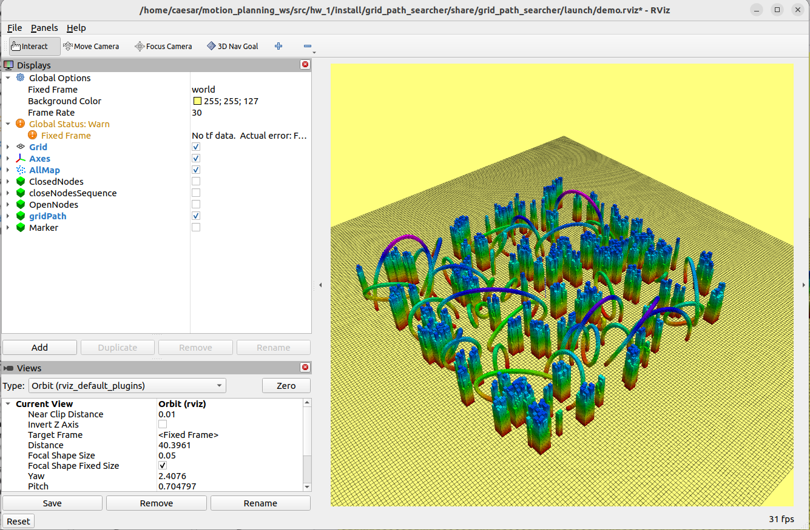

# 第一章 路径搜索模块（基于 ROS 2）

本作业已全面迁移至 ROS 2 Humble 环境，支持标准 `colcon` 构建和 `launch.py` 启动方式，实现了基于网格地图结构的路径搜索，并通过 RViz 进行可视化。

---

## 学习目标

- 熟悉 ROS 2 工作空间创建与 colcon 构建流程

---

## 文件结构说明

```
hw_1/
├── src/
│   ├── grid_path_searcher/       # 路径搜索主程序包
│   ├── rviz_plugins/             # RViz 插件（目标点选择工具）
│   └── waypoint_generator/       # 路径采样与轨迹生成
├── README.md                     # 作业说明文档
├── README.pdf                    # PDF 版本文档
└── result.png                    # ✅ 作业完成后的轨迹效果图
```

---

## 准备工作空间

### 1. 创建 ROS 2 工作空间

```bash
mkdir -p ~/motion_planning_ws/src
cd ~/motion_planning_ws/src
```

### 2. 收集代码

将 `hw_1/` 文件夹放入 `src/` 目录下：

```bash
cd ~/motion_planning_ws/src
# 如果是压缩包，请先解压
# unzip hw_1.zip
```

---

## 运行环境

- 操作系统：Ubuntu 22.04
- ROS 版本：ROS 2 Humble
- 构建工具：colcon
- 可视化工具：RViz2

请确保已正确安装 ROS 2 Humble，并配置环境变量：

```bash
source /opt/ros/humble/setup.bash
```

---

## 构建项目

进入工作空间根目录并构建：

```bash
cd ~/motion_planning_ws
colcon build --packages-select grid_path_searcher
```

构建成功后，配置环境变量：

```bash
source install/setup.bash
```

---

## 启动路径搜索系统

启动路径解算节点：

```bash
ros2 launch grid_path_searcher demo.launch.py
```

启动成功后，系统将自动打开 RViz 界面。初始界面如下图所示：

- **启动后效果**：

  


  

---

## 常见问题

### Q1: 找不到包 `grid_path_searcher`
请确认是否已运行环境变量声明命令：

```bash
source install/setup.bash
```

### Q2: 构建报错找不到 `catkin_pkg`
请使用系统 Python，不要在 Anaconda 环境下构建：

```bash
which python3
# 应为：/usr/bin/python3
```

---
## 👥 Authors and Maintainers
_This README was written by the current maintainer based on the original project developed by the authors below._

<hr/>

<p align="right">
  <strong>Original Authors:</strong><br>
  Fei Gao &lt;ustfeigao@gmail.com&gt;<br><br>
  Shaojie Shen &lt;eeshaojie@todo.todo&gt;<br><br>

  <strong>Past Maintainer:</strong><br>
  Zhenpeng Ge &lt;zhenpeng.ge@qq.com&gt;<br><br>

  <strong>Current Maintainer:</strong><br>
  Zhiye Zhao &lt;caesar1457@gmail.com&gt; (2025–)
</p>

