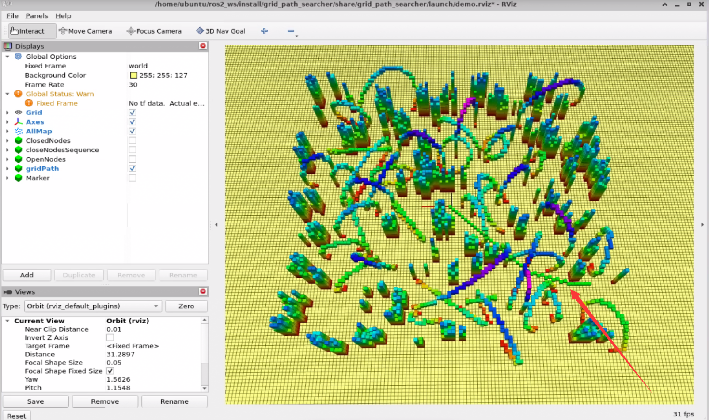
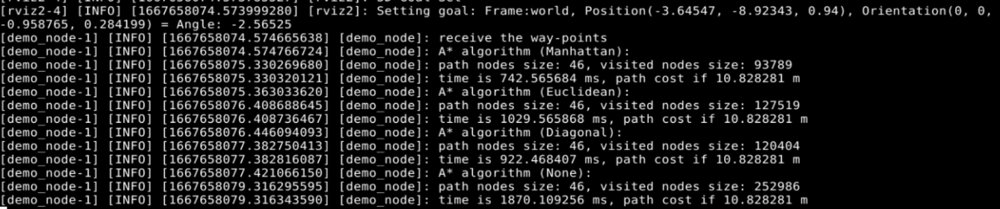
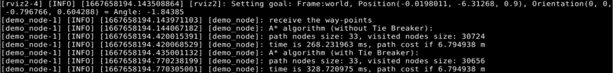
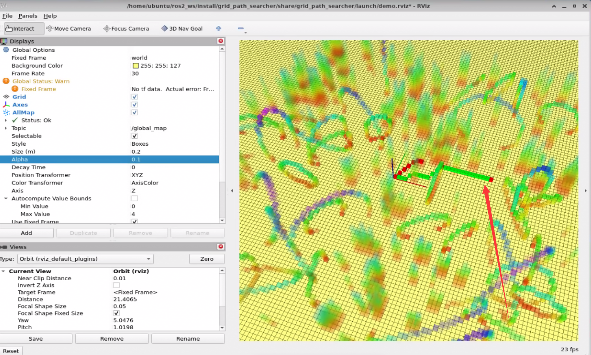
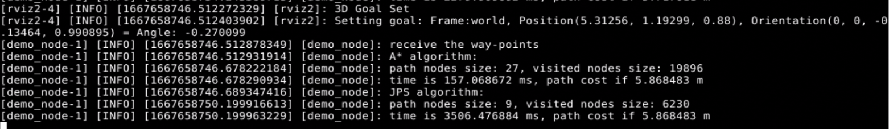

# 第二章作业

## 1.作业说明

* 运行环境：ROS2 Humble
* 代码详见`src`目录，修改较大，将原始代码移植到ROS2中，`astar_path_finder.hpp/cpp` 为A*算法实现，`jps_path_finder.hpp/cpp` 为JPS算法实现。

遇到的问题及解决方法：

问题：生成的路径会与地图方块接触，甚至穿过。

* 解决方法：这是因为rviz可视化的地图与astar算法进行搜索的网格地图不同导致的， 修改生成地图的代码`random_complex_generator.cpp`，对生成的点云地图进行了网格对齐。

## 2.A*算法流程及运行结果

运行命令

```bash
ros2 launch grid_path_searcher demo.launch.py test_case:=astar
```

随机在地图上选点，得到rviz可视化运行结果如下图（路径见箭头符号）：



算法流程

* 略

## 3.启发式函数对A*运行效率的影响

运行命令

```bash
ros2 launch grid_path_searcher demo.launch.py test_case:=astar_heuristic_function
```

在随机在地图上选点，得到对比结果如下（一次）：



* 经过多次选点，均得到类似效果，不同启发式函数下的运行效率的关系如下：Manhanttan> Diagonal > Euclidean > None （Dijkstra）
* 其中采用启发式函数相比于不使用启发式函数，运行效率得到大幅度明显提升。

## 4. Tie Breaker对A*运行效率的影响

运行命令

```bash
ros2 launch grid_path_searcher demo.launch.py test_case:=astar_tie_breaker
```

在随机在地图上选点，得到对比结果如下（系数为0.001时，即`h = h + cross * 0.001`）：



在随机在地图上选点，得到对比结果如下（系数为1时，即`h = h + cross * 1`）：


* 在系数为0.001的时候，不但没有A*的效率不但没有提升，反而下降，因为系数太小导致tie breaker并没有发挥作用，而计算tie breaker中的向量积会耗费更多的时间。
* 在系数为1的时候，tie breaker对A*的运行效率提升明显，访问节点的数量显著减少，使得搜索时间大幅度下降。

## 5. A*调用JPS算法效率分析

运行命令

```bash
ros2 launch grid_path_searcher demo.launch.py test_case:=astar_jps
```

在随机在地图上选点，rviz可视化结果如下（绿色为astar路径，红色为jps路径）：



运行效率结果如下图所示：



* 不难发现jps的运行效率远低于A*方法，但是jps访问节点数量要小于A\*方法，这是因为我们随机生成的地图障碍物较为稀疏，在jump过程中的搜索扩展非常耗时。


