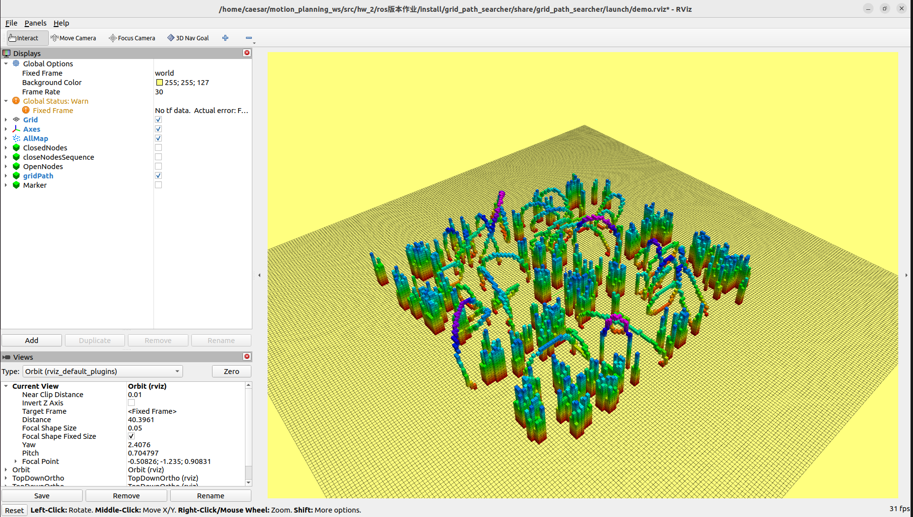
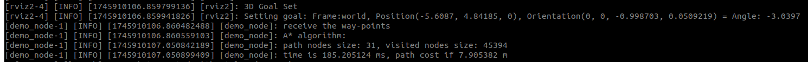
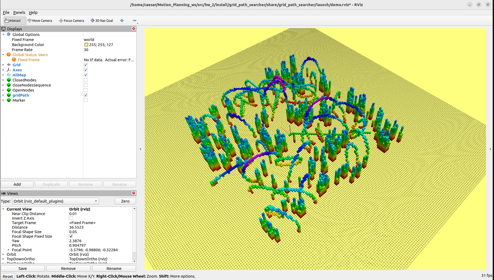
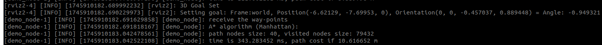
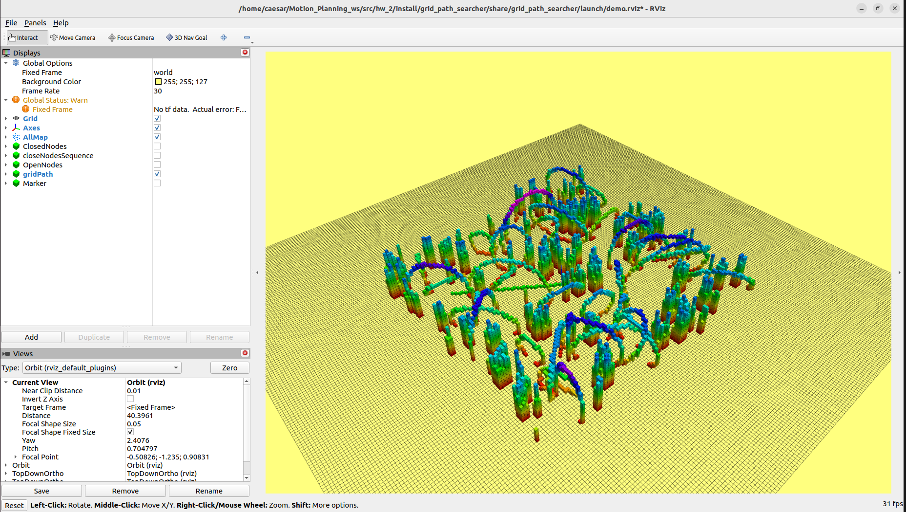
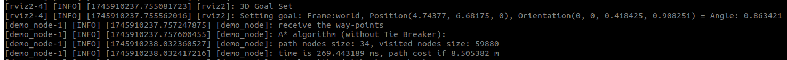
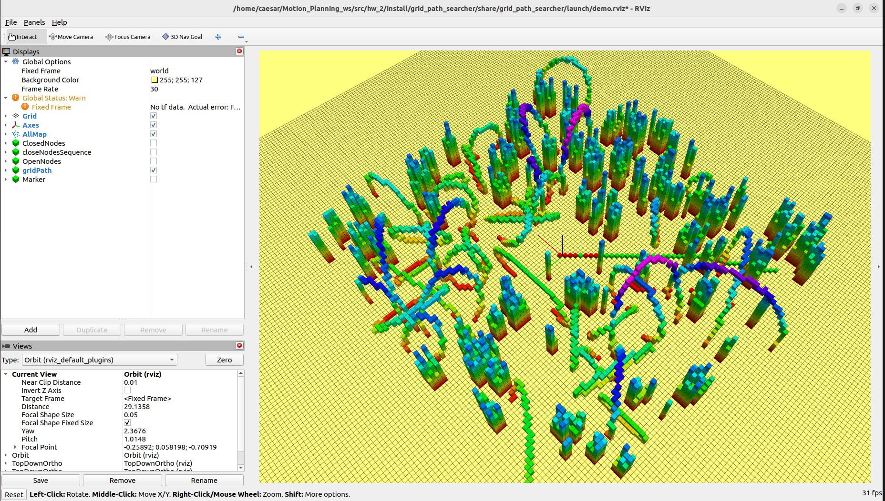
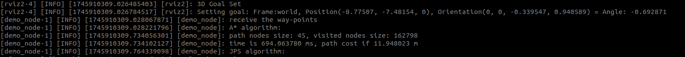

# 第二章 A*路径规划

## 作业简介
本次作业旨在帮助同学掌握经典路径规划算法——A*算法的基本原理与ROS2编程实现方法。通过在三维栅格地图中完成路径搜索，同学将提升以下能力：

- 熟悉路径规划算法的搜索流程与优化技巧；
- 深入理解启发式函数对搜索效率的影响。

---

## 项目结构说明

项目包含如下目录结构，已为你准备好完整的运行框架：

```
grid_path_searcher/
├── include/grid_path_searcher/
│   ├── astar_path_finder.hpp       # A*路径搜索类声明
│   ├── jps_path_finder.hpp         # JPS路径搜索类声明
│   ├── jps3d_neib.hpp              # JPS邻接搜索
│   ├── backward.hpp                # JPS后向跳点搜索
│   └── demo_node.hpp               # 主节点回调与流程声明
├── src/
│   ├── astar_path_finder.cpp       # ✅ 需完成：A*算法核心实现文件
│   ├── jps_path_finder.cpp         # ⭕ 选做：JPS算法实现
│   ├── jps3d_neib.cpp              # JPS邻接扩展实现
│   ├── random_complex_generator.cpp # 地图生成器（用于生成复杂地图）
│   ├── demo_node.cpp               # ROS回调函数、路径调用主逻辑
│   └── demo_node_main.cpp          # 程序主入口，初始化ROS节点
├── CMakeLists.txt                  # ROS2构建配置文件
├── package.xml                     # 功能包元信息
├── README.md / README.pdf          # 作业说明文档
```

注意事项：

- `astar_path_finder.cpp` 是必须完成的部分。
- `jps_path_finder.cpp` 是选做项。
- 其他文件已配置好框架，同学们**无需修改**。

---

## 实现任务说明

请在 `astar_path_finder.cpp` 中完成以下四个函数的具体实现：

1. `void AstarPathFinder::AstarGetSucc(...)`
2. `double AstarPathFinder::getHeu(...)`
3. `void AstarPathFinder::AstarGraphSearch(...)`
4. `vector<Vector3d> AstarPathFinder::getPath(...)`

代码中已标注 `STEP 1 ~ STEP 8` 的提示，请按步骤完成。

### JPS 选做任务：

- 文件：`jps_path_finder.cpp`
- 关键函数：`void JPSPathFinder::JPSGraphSearch(...)`
- 注意：`JPSGetSucc(...)` 已提供

---

## 作业提交要求

请提交以下两项：

1. `grid_path_searcher` 目录下的完整可编译运行功能包。
2. 一份**PDF格式说明文档**，包含内容如下：
   - 算法流程说明 + 流程图（推荐使用 draw.io 绘制）
   - RViz 可视化结果截图
   - 不同启发式函数（Manhattan、Euclidean、Diagonal）效率比较
   - 是否使用 Tie Breaker 的效果比较分析
   - 遇到的问题与解决方法
   - ✅（选做）JPS 与 A* 在不同地图条件下的效率对比
   - ✅（选做）其他你认为值得展示的内容，如路径平滑优化等

---

## 程序执行流程概览

本项目使用 ROS2 启动文件 `demo.launch.py` 控制不同测试案例的运行逻辑。系统在 RViz 中接收用户点击生成的目标点，并基于所选测试用例执行路径搜索算法。整体执行流程如下：

### 编译与准备

在工作空间中构建功能包并加载环境：

```bash
colcon build 
source install/setup.bash
```
成功启动后，RViz 将加载地图及起点状态如下：


### 启动测试命令

根据测试目的选择不同的参数启动：

```bash
# 启动基础 A* 测试
ros2 launch grid_path_searcher demo.launch.py test_case:=astar
```
下图展示了 A* 算法的基本路径搜索效果，路径较平滑但搜索范围较广：
<!--  -->


```bash
# 启发式函数对比测试
ros2 launch grid_path_searcher demo.launch.py test_case:=astar_heuristic_function
```
使用不同启发式函数（Manhattan、Euclidean、Diagonal）会影响搜索方向与节点展开效率。下图为其中一种启发式函数效果：
<!--  -->


```bash
# Tie Breaker 测试
ros2 launch grid_path_searcher demo.launch.py test_case:=astar_tie_breaker
```
Tie Breaker 在代价相同节点间引入偏好，有助于路径集中向目标方向，如图所示：
<!--  -->


```bash
# JPS 路径搜索测试（选做）
ros2 launch grid_path_searcher demo.launch.py test_case:=astar_jps
```
Jump Point Search 在空旷环境中能跳过大量无效节点，生成路径更加紧凑直接：
<!--  -->


### 效果图
以下为基础 A* 算法路径搜索的另一视角图，可见节点扩展密集，但路径稳定：

### 程序内部逻辑

路径搜索流程由 `demo_node.cpp` 中的回调与路径搜索函数共同构成：

- **地图回调函数** `pointcloud_callBack`
  - 解析点云并设置障碍物进栅格地图。

- **目标点回调函数** `waypoints_callback`
  - 接收 RViz 中点击设置的目标点。
  - 根据 `test_case` 参数判断调用 A* 还是 JPS：
    ```cpp
    find_path(_start_pt, target_pt, use_jps);
    ```

- **路径搜索函数** `find_path(...)`
  - 使用 A* 或 JPS 路径搜索：
    ```cpp
    if (!use_jps)
        astar_path_finder_->AstarGraphSearch(start_pt, end_pt);
    else
        jps_path_finder_->JPSGraphSearch(start_pt, end_pt);
    ```
  - 获取路径并通过 RViz 可视化：
    ```cpp
    auto path = astar_path_finder_->getPath();
    visGridPath(path, use_jps);
    ```

✅ 启用 JPS 无需修改代码，只需通过 launch 参数设置：
```bash
ros2 launch grid_path_searcher demo.launch.py test_case:=astar_jps
```
系统将自动调用 JPS 搜索器并展示红色路径结果。


---
## 👥 Authors and Maintainers
_This README was written by the current maintainer based on the original project developed by the authors below._

<hr/>

<p align="right">
  <strong>Original Authors:</strong><br>
  Fei Gao &lt;fgaoaa@zju.edu.cn&gt;<br><br>


  <strong>Current Maintainer:</strong><br>
  Zhiye Zhao &lt;caesar1457@gmail.com&gt; (2025–)
</p>
