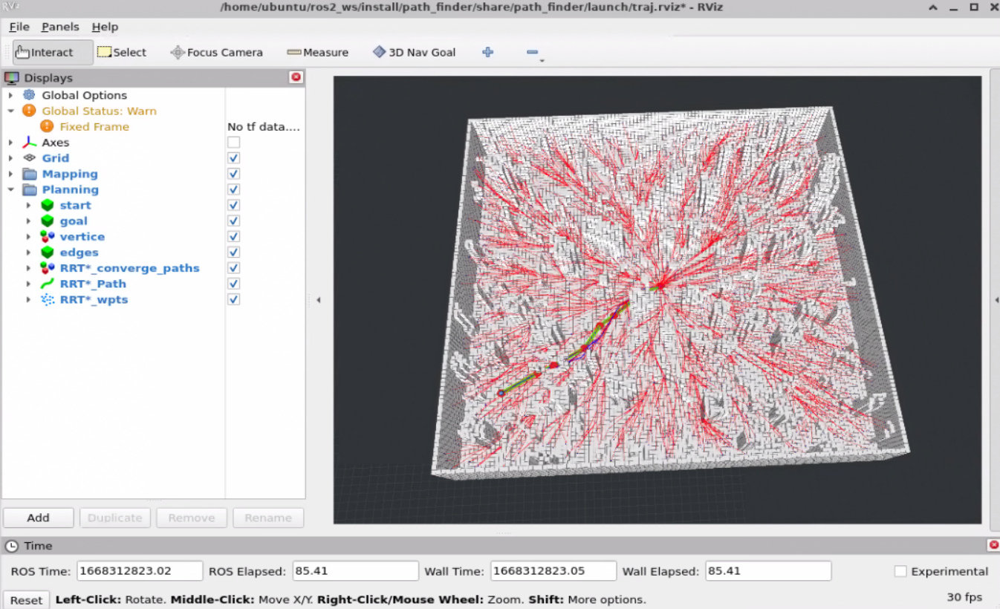
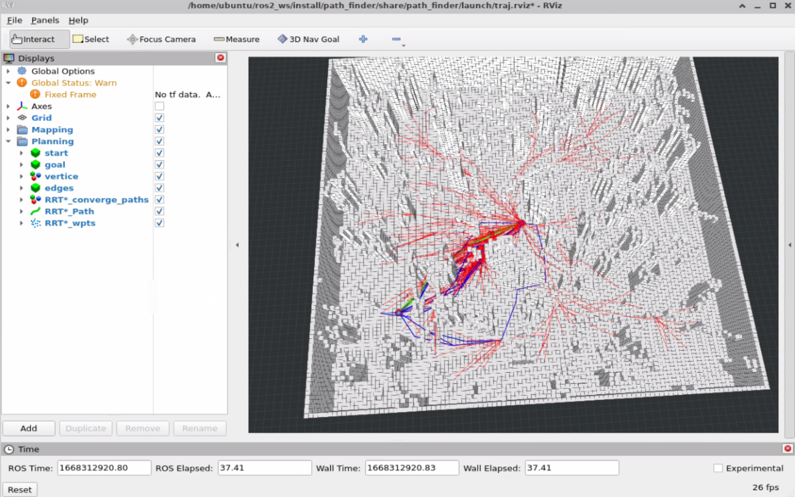

# 第三章作业

## 1.作业说明

* 运行环境：ROS2 Humble
* 代码详见`src`目录，修改较大，将原始代码移植到ROS2平台中。

主要实现内容：

* 在`rrt_star.h` 中，补全RRT\*算法实现。
* 在`sampler.h`中，实现Informed采样器`InformedSampler`， 并修改`rrt_star.h`实现 Informed RRT\* .

## 2.RRT\*运行结果

运行命令

```bash
ros2 launch path_finder test_planners.launch.py test_case:=rrt_star
```

随机在地图上选点，得到rviz可视化运行结果如下图：




## 3.Informed RRT\*运行结果

运行命令

```bash
ros2 launch path_finder test_planners.launch.py test_case:=informed_rrt_star
```

随机在地图上选点，得到rviz可视化运行结果如下图：



结果分析

* 可以明显发现Informed RRT\* 的搜索节点集中在起点和终点之间的椭球中，可以提高搜索效率。
