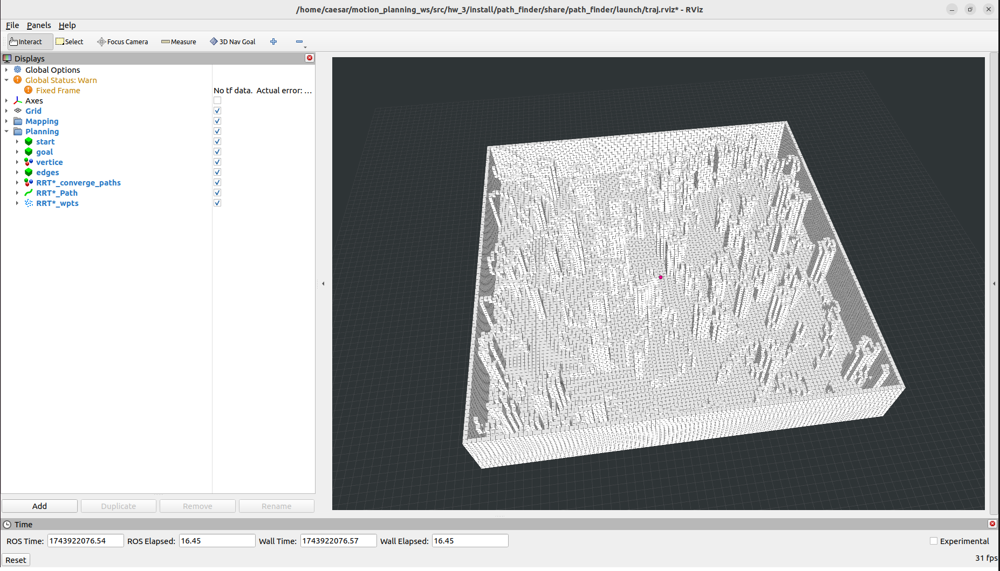
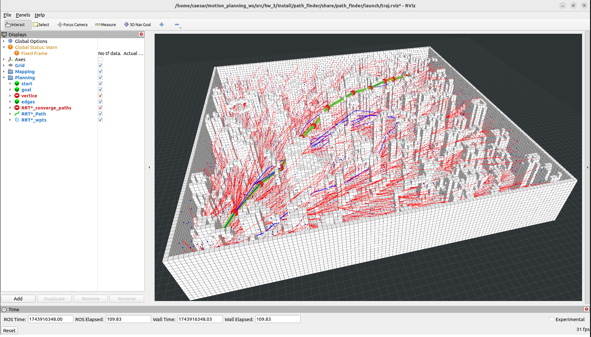
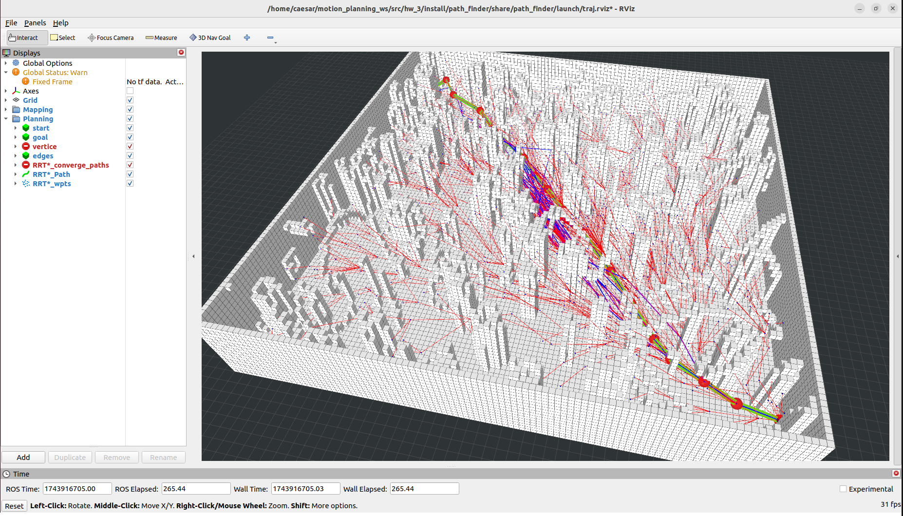

# 第三章 RRT, RRT* 和 Informed RRT*
本章将带领你由浅入深掌握三种典型的采样路径规划方法：基础的 RRT、优化版本 RRT*，以及进一步提升效率的 Informed RRT*。

我们首先在 MATLAB 环境中实现 RRT 算法，加深对其核心思想的理解。随后，进入 ROS2 环境中，借助 C++ 实现 RRT* 及其 Informed 扩展版本，并通过 RViz 进行三维可视化展示。通过理论与实践结合，逐步建立你对采样型路径规划算法的工程实现能力。

---

## RRT

### 文件结构

作业目录下包含一个 `RRT.m` 脚本文件。请在该文件中按照 `STEP 1 ~ STEP 6` 的注释，依次补全代码。

### 运行方式

打开 MATLAB 并进入作业目录，运行：

```matlab
RRT.m
```

### 学习目标

- 实现随机采样
- 完成最近点搜索
- 实现路径回溯

---

## RRT* (C++)

## 文件结构说明

以下为 `hw_3` 作业项目的文件结构：

```
hw_3/
├── build/                     # 编译生成文件
├── install/                   # 安装文件
├── log/                       # 日志目录
├── src/
│   ├── map_generator/         # 场景生成器
│   ├── occ_grid/              # 占据网格模块
│   └── path_finder/           # ⭐ 路径规划主模块
│       ├── include/path_finder/
│       │   ├── rrt_star.h             # ✅ 作业核心文件，请在此完成 TODO 部分
│       │   ├── kdtree.h               # K-D Tree 辅助结构
│       │   ├── node.h                 # 树节点定义
│       │   ├── sampler.h              # 采样模块
│       │   └── visualization.hpp      # 可视化工具类
│       ├── launch/                    # 启动文件夹
│       └── src/                       # 源码实现部分
├── CMakeLists.txt             # 编译配置
├── package.xml                # ROS2 包配置
├── rviz_plugins/              # RViz 配置（
```

---

### 编译说明

此项目已为 ROS2 Humble 环境配置完成，无需额外创建工作空间。请在 `hw_3` 文件夹内直接编译：

```bash
cd ~/your_path_to_hw_3
colcon build 
source install/setup.bash
```

### 启动方式

完成编译后，运行：

```bash
ros2 launch path_finder test_planners.launch.py test_case:=rrt_star
```

程序将自动启动 RViz，并加载默认配置与场景。只需使用 `3D Nav Goal` 左键设置终点位置和方向，右键移动设z轴高度。



### 完成任务

打开文件：

```cpp
src/path_finder/include/path_finder/rrt_star.h
```

请按照注释 `// TODO:` 补全如下逻辑：
z
- Parent selection (`ChooseParent`)
- Rewiring (`Rewire`)

完成后再次编译并运行查看效果。

### 可视化效果示例

下图展示了完成后的 RRT* 效果图：



---

## Informed RRT*（拓展任务）

### 简介

Informed RRT* 是 RRT* 的优化版本，它在首次找到可行解后，限定采样区域为一个槽球体，从而提升路径收敛速度和质量。

### 拓展任务

1. 打开 `rrt_star.h` 文件。
2. 启用并实现如下部分：

```cpp
enable_informed_sampling_ = true;
informed_sampler_.samplingOnce(x_rand);
```

3. 补全逻辑后重新编译，运行：

```bash
ros2 launch path_finder test_planners.launch.py test_case:=informed_rrt_star
```


### 可视化效果示例

Informed RRT* 会显著减少冗余节点，提升收敛路径质量，如下图所示：



---
## 👥 Authors and Maintainers
_This README was written by the current maintainer based on the original project developed by the authors below._

<hr/>

<p align="right">
  <strong>Original Authors:</strong><br>
  Kyle Yeh &lt;kyle_yeh@163.com&gt;<br>
  Yehongkai &lt;yehongkai@todo.todo&gt;<br><br>

  <strong>Past Maintainer:</strong><br>
  Zhenpeng Ge &lt;zhenpeng.ge@qq.com&gt;<br><br>

  <strong>Current Maintainer:</strong><br>
  Zhiye Zhao &lt;caesar1457@gmail.com&gt; (2025–)
</p>


