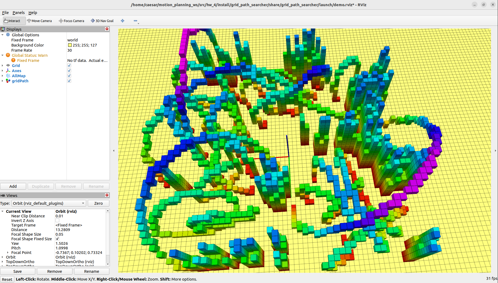
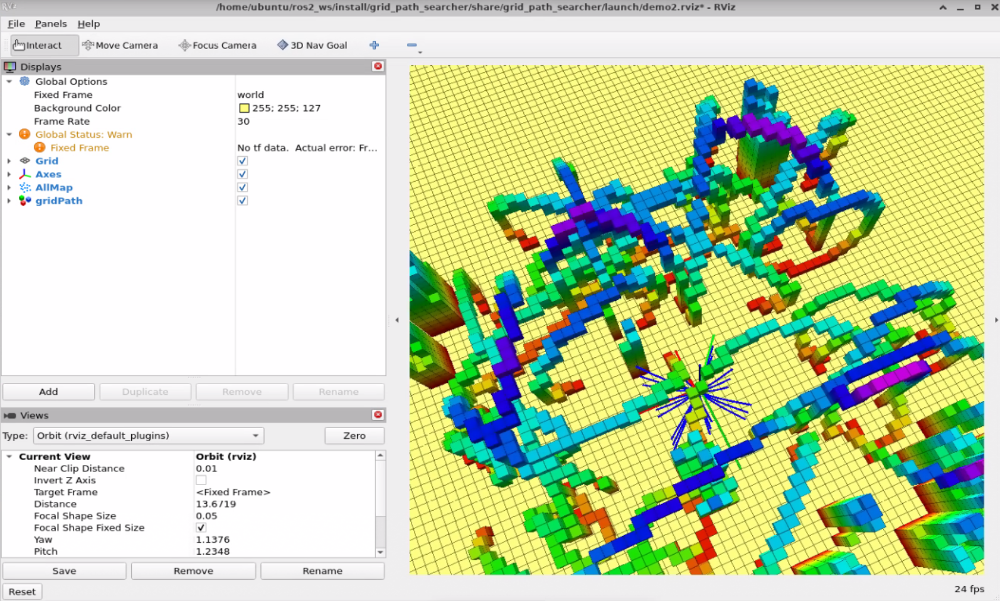

# 第四章 Local Lattice Planner

本作业实现了一种基于线性模型的轨迹规划算法，经由分装实现了 Forward Integration 和 OBVP (Optimal Boundary Value Problem)，用于领域轨迹生成和最优路径选择。

---

## 学习目标

- 熟悉线性模型下的 Forward Integration 进程
- 理解 OBVP (边界值问题)的构建和解法
- 学会利用路径跟踪成本选择最优路径

---

## 项目结构

```
hw_4/
├── build/
├── install/
├── log/
├── src/
│   └── grid_path_searcher/
│       ├── include/homework_tool/
│       │   └── hw_tool.hpp              # 作业工具函数声明
│       ├── launch/
│       │   └── demo.launch.py
│       ├── src/
│       │   ├── demo_node_main.cpp
│       │   ├── demo_node.cpp           # STEP 1: Forward Integration 实现位
│       │   ├── hw_tool.cpp              # STEP 2: OBVP 解析进行位
│       │   └── random_complex_generator.cpp
├── map_generator/
├── occ_grid/
├── path_finder/
├── rviz_plugins/
├── waypoint_generator/
├── CMakeLists.txt
├── package.xml
├── initial.png                 # 启动后状态
├── result.png                  # 完成作业效果
├── README.md
└── README.pdf
```

---

##  程序构建 & 启动

```bash
cd ~/motion_planning_ws
colcon build 
source install/setup.bash

ros2 launch grid_path_searcher demo.launch.py
```

启动成功后，使用 "3D Nav Goal" 设置目标点，RViz 界面如下：



---

## 编程任务说明

依据代码注释，作业分为两步：

### STEP 1 - Forward Integration

文件：`src/grid_path_searcher/src/demo_node.cpp`

请根据给定的移动方程，实现 Forward Integration ：

```cpp
// pos = pos + vel * delta_time + 0.5 * acc_input * delta_time * delta_time;
// vel = vel + acc_input * delta_time;
```

根据移动路径与障碍梯级，判断轨迹是否发生碰撞。

### STEP 2 - OBVP (Optimal BVP)

文件：`src/grid_path_searcher/src/hw_tool.cpp`

请完成 `Homeworktool::OptimalBVP(...)` 函数，根据 PDF 算法模型：

- 定义辅助函数 H
- 进行 costate 分析
- 求解最优控制量 u*
- 求解最优状态轨迹 x*
- 计算成本 J(T)，并选择最优 T

推荐使用 Ceres 对 T 进行数值优化，返回路径成本。

---

## 作业完成效果

完成 Forward Integration 和 OBVP 后，系统将自动选择最优路径并输出：

- 无障碍路径
- 最优跟踪成本
- RViz 中显示轨迹如下：



---

## 👥 Authors and Maintainers

_This README was written by the current maintainer based on the original project developed by the authors below._

<hr/>

<p align="right" style="line-height: 1.6; font-size: 14px;">
  <strong>Original Authors:</strong><br>
  Fei Gao &lt;fgaoaa@zju.edu.cn&gt;<br>
  Kyle Yeh &lt;kyle_yeh@163.com&gt;<br>
  Yehong Kai &lt;yehongkai@todo.todo&gt;<br>


  <strong>Current Maintainer:</strong><br>
  Zhiye Zhao &lt;<a href="mailto:caesar1457@gmail.com">caesar1457@gmail.com</a>&gt; (2025–)
</p>

