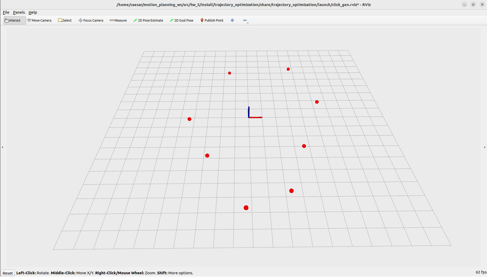
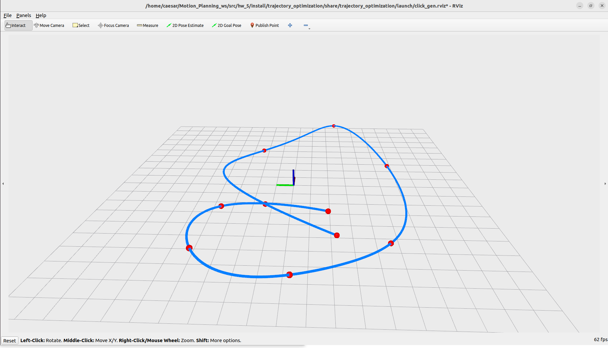

# 第五章 最小加加速度轨迹生成（Minimum Jerk Trajectory）

本章将带你理解并实现一种轨迹生成方法 —— **最小加加速度轨迹（Minimum Jerk Trajectory）**。本质上，该方法旨在生成平滑轨迹，使得加加速度（Jerk）最小化，从而提升机器人的运动自然性。

我们在 ROS 2 Humble 环境中实现了轨迹优化模块 `click_gen.cpp`，通过构建 M 矩阵并直接求逆得到系数矩阵，实现对任意多个点击点之间的最优轨迹连接。该算法最终效果可在 RViz 中实时可视化查看。

---

## 学习目标

- 熟悉轨迹多项式建模方法
- 掌握最小加加速度轨迹的数学形式


---

## 文件结构说明

以下为 `hw_5` 项目文件结构：

```
hw_5/
├── build/                        # 编译生成文件
├── install/                      # 安装目录
├── log/                          # 编译日志
├── src/
│   └── trajectory_optimization/
│       ├── config/
│       ├── include/
│       ├── launch/
│       └── src/
│           └── click_gen.cpp     # ✅ 作业代码
├── CMakeLists.txt
├── package.xml
├── Initial.png                   # 启动后等待点击时的可视化效果
├── result.png                    # 作业完成后的轨迹可视化效果
└── README.md                     # 本文档
```

---

## 编译说明

本项目已为 ROS 2 Humble 环境配置完成，请在 `hw_5` 文件夹内直接进行编译：

```bash
cd ~/your_path_to_hw_5
colcon build 
source install/setup.bash
```

---

## 启动方式

完成编译后，运行以下命令：

```bash
ros2 launch trajectory_optimization click_gen.launch.py
```

程序将自动启动 RViz，并显示轨迹点击生成器界面。请使用 **"2D Goal Pose"工具** 在地图上点击多个目标点，系统将记录该位置并进行轨迹规划。

当程序加载正常时，界面如下图所示：

- **初始状态**：

  

---

## 编程任务说明

请打开以下文件：

```cpp
src/trajectory_optimization/src/click_gen.cpp
```

根据注释，补全如下函数实现：

```cpp
void minimumJerkTrajGen(...) {
    // 构建 M 矩阵与 b 向量
    // 使用 M.inverse() * b 求解轨迹段系数矩阵 coefficientMatrix
}
```

### 实现要点：

- 构造轨迹约束矩阵 M（初始约束 + 中间点 + 终点约束）
- 构造目标向量 b（包含起点、终点状态与中间点位置）
- 求解线性方程 \( M \cdot c = b \) 得到轨迹系数

由于本例中轨迹段数有限，直接使用 `M.inverse()` 即可求解，无需稀疏求解器优化。

一旦你完成上述函数实现并重新编译，再次运行程序并点击若干点，系统将自动生成并可视化平滑轨迹，如下图所示：

- **作业完成后的轨迹效果**：

  

---

## 👥 Authors and Maintainers

This README was written by the current maintainer based on the original project developed by the authors below.

<hr/>

<p align="right">
  <strong>Original Authors:</strong><br>
  Zhepei Wang &lt;wangzhepei@live.com&gt;<br><br>

  <strong>Past Maintainer:</strong><br>
  Zhenpeng Ge &lt;zhenpeng.ge@qq.com&gt;<br><br>

  <strong>Current Maintainer:</strong><br>
  Zhiye Zhao &lt;caesar1457@gmail.com&gt; (2025–)
</p>


