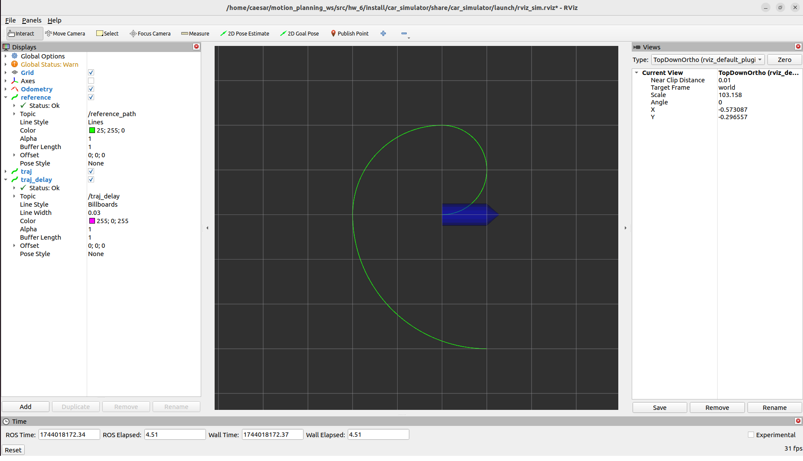
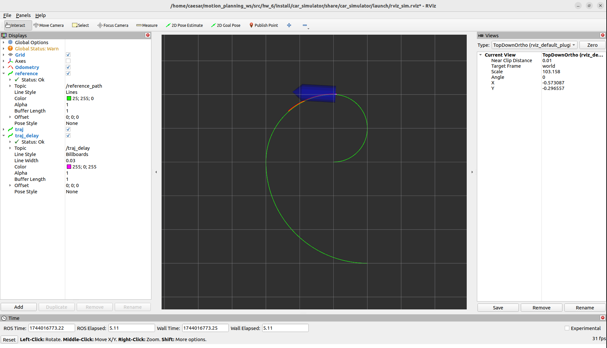

# 第六章 模型预测控制轨迹跟踪（MPC for Trajectory Tracking）

本章实现了一种基于模型预测控制 (MPC) 的轨迹跟踪算法，结合 OSQP 求解器，在 ROS 2 Humble 环境中实现了对车辆的预测跟踪控制。

本次作业在 `mpc_car.hpp` 文件中补全了核心控制逻辑，包括状态线性化、控制延迟补偿、约束构建与 MPC 预测路径等模块。最终效果可在 RViz 中实时可视化查看。

---

## 学习目标

- 理解离散化车辆模型的线性化方法  
- 掌握 MPC 预测控制框架与约束构建流程  
- 学会将优化问题形式化并调用 OSQP 求解器  
- 熟悉 ROS2 节点结构、话题发布与可视化方式  

---

## 文件结构说明

```
hw_6/
├── build/                    # 编译输出
├── install/                  # 安装目录
├── log/                      # 日志目录
├── src/
│   └── mpc_car/
│       ├── include/mpc_car/mpc_car.hpp   # ✅ 作业代码
│       ├── src/mpc_car.cpp
│       ├── launch/simulation.launch.py
│       └── ...
├── third_party/osqp/         # 外部优化库 OSQP
├── CMakeLists.txt
├── Initial.png               # 启动后初始状态
├── result.png                # 作业完成后的轨迹效果
└── README.md                 # 本文档
```

---

## 编译说明

首先在 `third_party/osqp/` 目录下安装优化器：

```bash
cd third_party/osqp
mkdir build && cd build
cmake .. -G "Unix Makefiles" -DCMAKE_INSTALL_PREFIX=install
make -j$(nproc)
make install
```

然后返回项目根目录进行编译：

```bash
cd ~/motion_planning_ws
colcon build
source install/setup.bash
```

---

## 启动方式

运行以下指令启动模拟器和 RViz 可视化：

```bash
ros2 launch mpc_car simulation.launch.py
```

系统启动成功后，将自动打开 RViz 界面。初始界面如下图所示：

- **初始状态**：

  

---

## 编程任务说明

请完成下列文件中的核心函数：

```
src/mpc_car/include/mpc_car/mpc_car.hpp
```

任务要点包括：

- 在 `linearization(...)` 中补全状态转移矩阵 `Ad_`、输入矩阵 `Bd_`和偏移量 `gd_`
- 在 `compensateDelay(...)` 中实现控制延迟补偿逻辑
- 在 `solveQP(...)` 中补全 MPC 中的大矩阵 `BB`、`AA`、`gg` 和代价向量 `qx`
- 构建约束矩阵，并调用 OSQP 求解器

---

## 作业完成后效果

完成所有函数实现后，系统将自动跟踪轨迹，显示 MPC 预测轨迹与延迟补偿效果：

- **轨迹跟踪效果**：

  

---

## 👥 Authors and Maintainers

This README was written by the current maintainer based on the original project developed by the authors below.

<hr/>

<p align="right" style="line-height: 2.0; font-size: 14px;">
  <strong>Original Authors:</strong><br>
  Zhepei Wang &lt;wangzhepei@live.com&gt;<br>
  ji &lt;jlji@zju.edu.cn&gt;<br>
  fgaoaa &lt;ustfeigao@gmail.com&gt;<br>
  kyleYeh &lt;kyle_yeh@163.com&gt;<br>
  yehongkai &lt;yehongkai@todo.todo&gt;<br>
  Shaojie Shen &lt;eeshaojie@todo.todo&gt;<br><br>

  <strong>Past Maintainer:</strong><br>
  Zhenpeng Ge &lt;<a href="mailto:zhenpeng.ge@qq.com">zhenpeng.ge@qq.com</a>&gt;<br><br>

  <strong>Current Maintainer:</strong><br>
  Zhiye Zhao &lt;<a href="mailto:caesar1457@gmail.com">caesar1457@gmail.com</a>&gt; (2025–)
</p>

